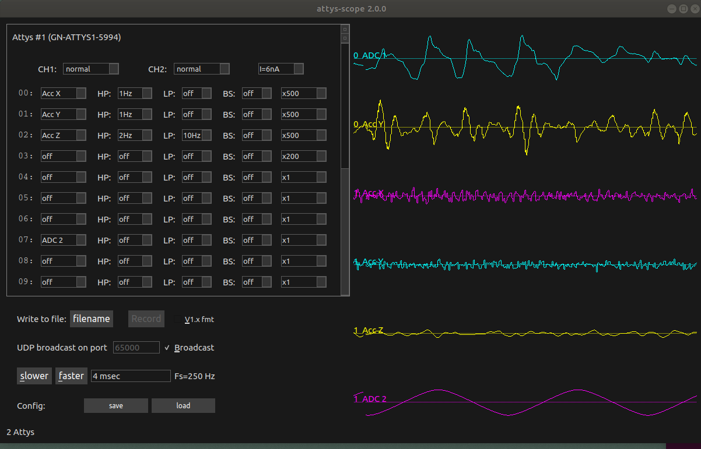

# attys-scope (Windows/Linux)

Oscilloscope program for the Attys (http://www.attys.tech).

## Features

* Records from multiple Attys at the same time.
* Tested BT dongles which work with more than one Attys: ASUS-BT400 and Belkin (Broadcom chipset).
* Python plugins to visualise data or feed the data into your favourite game engine (via UDP broadcast).
* Saves data as tab separated values which can be directly imported into Python, MATLAB ™, OCTAVE, R, GNUPLOT and many other software packages.
* Change the gain, highpass, lowpass, 50/60Hz bandstop and rectifier for amplitude plots

The screenshot above shows attys-scope in action under Windows where it feeds the data into a Python program
which then plots a bar graph in realtime.

## Requires
* QT5
* IIR1 libaray (https://github.com/berndporr/iir1)
* AttysComm (https://github.com/glasgowneuro/AttysComm)

## Compile under Windows
* Install: Visual Studio 2017 community edition
* clone iir1 in your root directory: https://github.com/berndporr/iir1 and compile it (release version)
* Download the open source version of QT5, 64 bits for visual C++ 2015/2017 from www.qt.io:
  https://download.qt.io/official_releases/qt/5.7/5.7.0/qt-opensource-windows-x86-msvc2015_64-5.7.0.exe
* git clone https://github.com/glasgowneuro/AttysComm.git and compile it
* git clone https://github.com/glasgowneuro/attys-scope.git 
* "qmake -tp vc" and then re-target the project (right click on attys_scope in the Solutions Explorer -> Retarget Projects)
* Open the .sln file
* Build solution

## Compile under Linux
* git clone https://github.com/glasgowneuro/AttysComm.git and compile/install it.
* git clone https://github.com/glasgowneuro/attys-scope.git 
* Install the IIR filter library https://github.com/berndporr/iir1
* Install the other packages: "apt-get install qt5-qmake, g++, qtbase5-dev-tools, qtdeclarative5-dev-tools, libbluetooth-dev, qtbase5-dev, qt5-default"
* cd attys-scope
* qmake
* make
* make install
* Start by typing "attys-scope"

## Post- and realtime processing in Python
Check out the python subdirectory. This contains scripts for both postprocessing of datafiles and realtime processing.

## UNREAL gaming engine
The unreal subdirectory contains a class which receives UDP packets from attysscope and also screenshots of the blueprints for both a jumping and driving game
